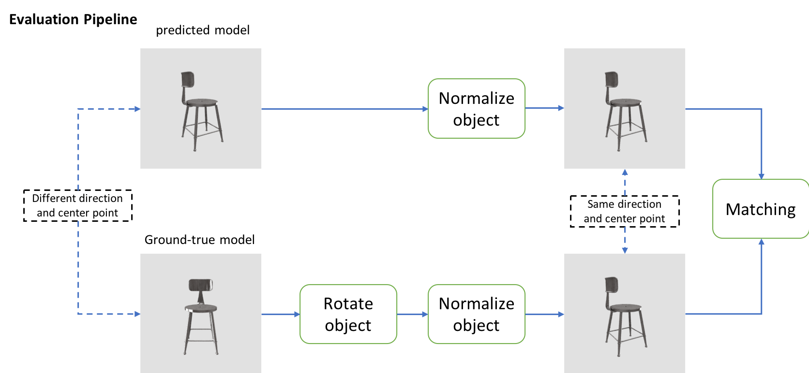

# IJCAI-PRICAI 2020 3D AI Challenge: 3D Object Reconstruction Baseline and Offical Evaluation Code


## Introduction

The codes have been modified from [Occupancy Networks](https://github.com/autonomousvision/occupancy_networks), and have been tested successfully on Ubuntu 18.04.3 LTS, Cuda 10.1, Tesla V100, Anaconda python3, Pytorch 1.5.

The codes are only for research purposes. You may also need to follow the instructions of Occupancy Networks.

## Requirements
Please refer to requirements on [Occupancy Networks](https://github.com/autonomousvision/occupancy_networks).

Also make sure you have installed the following python pacakges:
* tqdm
* Open3d


## Usage
**1. Data Preparation**
Validation data can be found in ```reconstruction_baseline/```. If you want to use your own data, please run commands below.
```
cd reconstruction
cp -r your_validation_data_path reconstruction_baseline
```

**2. 3D Model Generation**
``` 
bash generate.sh
```
  This script will download pre-trained model automatically and generate 3D models with required format. More details about reconstruction method please refers to [Occupancy Networks](https://github.com/autonomousvision/occupancy_networks).
  
  Please note that we have comment out the ```dmc``` imports in ```im2mesh/config.py``` 
  
**3. Evaluation**

Compute chamfer distance and mean_f_score using commands below:
``` 
### 1. prepare data for evaludation
## 1.1 prepare submit data - your data
zip -r reconstruction_results.zip reconstruction_results/
mv reconstruction_results.zip offical_evaluation

## 1.1 prepare submit data - provided data (our baseline result)
cd offical_evaluation/
# china
wget https://tianchi-competition.oss-cn-hangzhou.aliyuncs.com/231788/baseline_evaludation_data/reconstruction_results.zip
# overseas
wget https://tianchi-public-us-east-download.oss-us-east-1.aliyuncs.com/231788/baseline_evaludation_data/reconstruction_results.zip

## 1.2 prepare standard data (ground true data)
# ground true data is replaced using our generated data
cd offical_evaluation
# china
wget https://tianchi-competition.oss-cn-hangzhou.aliyuncs.com/231788/baseline_evaludation_data/standard_data.zip
# international
wget https://tianchi-public-us-east-download.oss-us-east-1.aliyuncs.com/231788/baseline_evaludation_data/standard_data.zip

### 2. evaluation
python evaluate.py input_param.json result.json 
```
For test purpose, we replace standard data (ground-true data) with our predicted model data.

Follwing graph shows the pipeline of evaluation script:
<div align=center></div>

## Online Result
Online result for baseline is shown as below. 
```
score: 65.7445, chamfer distance: 0.2149, mean_f_score: 42.2322
```
This baseline is different from the one in leaderboard. If you want to generate results similar to ours in leaderboard, please refer to [Pixel2mesh](https://github.com/nywang16/Pixel2Mesh)

## Acknowledgements
We borrow codes and pre-trained models from [Occupancy Networks](https://github.com/autonomousvision/occupancy_networks) to develop our baseline.
