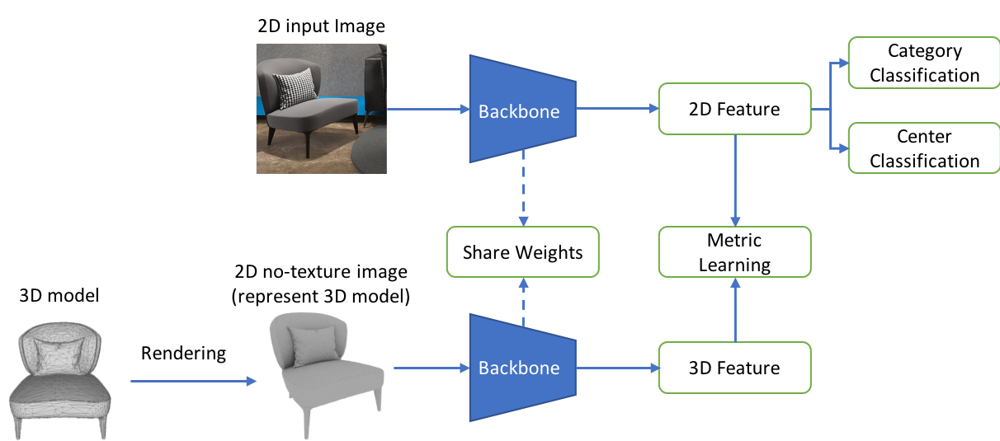

# IJCAI-PRICAI 2020 3D AI Challenge: Shape Retrieval Baseline and Offical Evaluation Code

## Introduction

The codes have been modified from [CycleGAN-Pix2Pix](https://github.com/junyanz/pytorch-CycleGAN-and-pix2pix), and have been tested successfully on Ubuntu 18.04.3 LTS, Cuda 10.1, Tesla V100, Anaconda python3, Pytorch 1.5.

The codes are only for research purposes. You may also need to follow the instructions of [CycleGAN-Pix2Pix](https://github.com/junyanz/pytorch-CycleGAN-and-pix2pix).

## Requirements
* Python3
* Pytorch
* Torchvision
* Pillow
* OpenCV
* Numpy
* dominate
* tqdm

## Update
**June-17-2020:** 
upload pytorch_metric_learning. If the module does not work for you, please download original version from https://github.com/KevinMusgrave/pytorch-metric-learning ;
## Data and Pre-trained Models
**Training and Test Data**

```
## download training data
cd retrieval/dataset/

# china
wget https://tianchi-competition.oss-cn-hangzhou.aliyuncs.com/231789/baseline_data/train_data.zip 
or
# overseas
wget https://tianchi-public-us-east-download.oss-us-east-1.aliyuncs.com/231789/baseline_data/train_data.zip

unzip train_data.zip

## download test data
# china
wget https://tianchi-competition.oss-cn-hangzhou.aliyuncs.com/231789/baseline_data/test_data.zip
or
# overseas
wget https://tianchi-public-us-east-download.oss-us-east-1.aliyuncs.com/231789/baseline_data/test_data.zip

unzip test_data.zip
```

**Pre-trained Models**

``` 
## Download provided pre-trained models
# china
wget https://tianchi-competition.oss-cn-hangzhou.aliyuncs.com/231789/baseline_data/workshop_baseline_notexture_tuning_v1.zip
or
# overseas
wget https://tianchi-public-us-east-download.oss-us-east-1.aliyuncs.com/231789/baseline_data/workshop_baseline_notexture_tuning_v1.zip

unzip workshop_baseline_notexture_tuning_v1.zip
```

**Evaluation Data**

We replace standard data (ground-true data) with sample data for test purpose.
```
## download standard data (ground-true data)
cd offical_evaluation
# china
wget https://tianchi-competition.oss-cn-hangzhou.aliyuncs.com/231789/evaluation_data/standard_data.zip
# overseas
wget https://tianchi-public-us-east-download.oss-us-east-1.aliyuncs.com/231789/evaluation_data/standard_data.zip

## download submit data (retreival result)
# china
wget https://tianchi-competition.oss-cn-hangzhou.aliyuncs.com/231789/evaluation_data/retrieval_results.zip
# overseas
wget https://tianchi-public-us-east-download.oss-us-east-1.aliyuncs.com/231789/evaluation_data/retrieval_results.zip
```


## Usage
### Training
**1. Data Preparation**

Make sure you have downloaded training data into ```dataset/```.

**2. Model Training**

The pipeline is shown as below:
<div align=center></div>


The entire training process includes two stages:
stage 1 - pre-train (classification only);
stage 2 - fine-tuning (classification + metric-learning);

```
# stage 1 - classification only
bash train_workshop_baseline_pretrain.sh

# stage 2 - classification + metric-learning
bash train_workshop_baseline_tuning.sh
```
**Note:** 
1. Please copy models (latest*) from stage-1 into stage-2 before training stage-2;
2. modify ``CUDA_VISIBLE_DEVICES=0,1``  to assign gpu_ids;

### Test

**1. Feature Extraction and Matching**
```
# extract 2D feature, generate folder: extract_workshop_baseline_notexture_2d_v1
bash extract_workshop_baseline_2d.sh

# extract 3D feature, generate folder: extract_workshop_baseline_notexture_3d_v1
bash extract_workshop_baseline_3d.sh

# matching 2D-3D, generate retrieval_results.txt
# default using euclidean distance
python eval_workshop_baseline.py

# prepare submit data for evaluation
zip retrieval_results.zip retrieval_results.txt
```
**2. Evaluation**

The evaluation script shows how to compute top1 Acc and mean_f_score. Please make sure you have downloaded standard data into ```offical_evaluation/```
```
# prepare submit data (ignored if using downloaded submit data)
mv retrieval_results.zip offical_evaluation/

# evaluation
python evaluate.py input_param.json result.json
```

## Online Result
Online result for baseline is shown as below. This result is better than the one in leaderboard.
```
"score": 60.14482022065204, "top1_acc": 0.5750211582638133, "mean_f_score": 65.05269981001194
```


