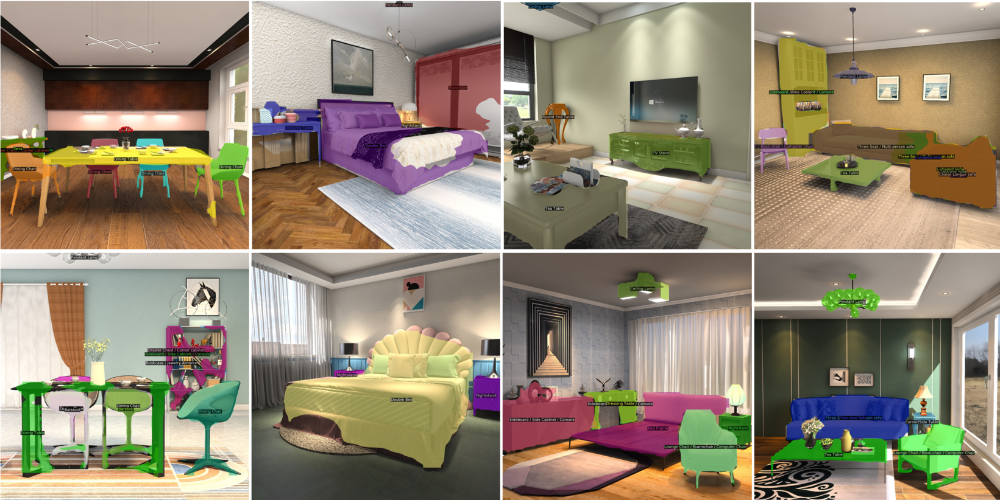

# IJCAI-PRICAI 2020 3D AI Challenge: Instance Segmentation Baseline (using MMDetection)
Cascade Mask R-CNN is adopted as the IJCAI-PRICAI 2020 3D AI Challenge - Instance Segmentation baseline method. The implementation is borrowed from [MMDetection](https://github.com/open-mmlab/mmdetection). 

## Introduction

### Cascade Mask R-CNN
|    Backbone     |  Style  | Lr schd | Mem (GB) | mask AP | AP50 | AP75 | APs | APm | APl | Download |
| :-------------: | :-----: | :-----: | :------: |  :-----: | :-----: | :-----: | :-----: | :-----: |:-----: | :----------------: |
| X-101-64x4d-FPN | pytorch |   1x    |  12.2    | 53.9 | 77.7 | 57.8 | 27.2 | 49.8 | 65.1 | model [CN](http://tianchi-competition.oss-cn-hangzhou.aliyuncs.com/231787/future3d_cascade_mask_rcnn_x101_64x4d_fpn_1x-7487f640.pth)&#124; [International](http://tianchi-public-us-east-download.oss-us-east-1.aliyuncs.com/231787/future3d_cascade_mask_rcnn_x101_64x4d_fpn_1x-7487f640.pth) |

## Installation

Please refer to [INSTALL.md](docs/INSTALL.md) for installation and dataset preparation.

## Get Started

Please see [GETTING_STARTED.md](docs/GETTING_STARTED.md) for the basic usage of MMDetection.

